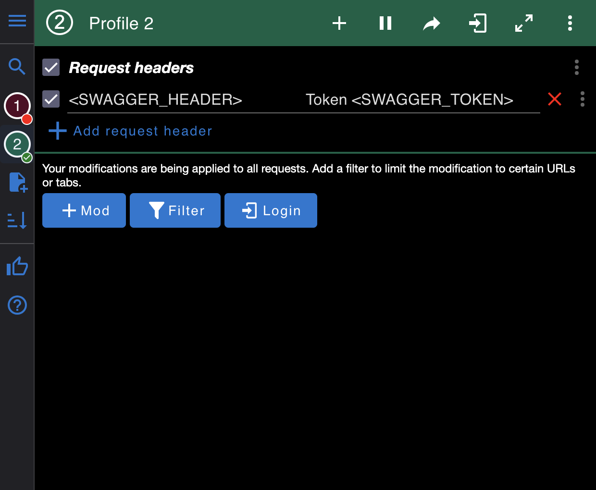

# DJANGO DEVELOPMENT CONFIG #

# Fast start to development Django project
This is template for Django app with next stack:
1. [x] Django
2. [x] Nginx
3. [x] docker-compose
4. [x] PostgreSQL
5. [x] Swagger/Redoc (read more in documentation)

### In terminal:
`cd` - go to main folder

`mkdir "name"` - create new folder with your "name"

`cd "name"` - change directory to created or skip this step

`git clone https://github.com/Geg3mon/django-config` - clone repository

`python3 -m venv venv` - create virtual environment

`source venv/bin/activate` - activate your environment

`pip install -r requirements.txt` - install requirments

### Update .env file with your configuration
In basic .env file you can find next settings:
```bash
DEBUG=True
SECRET_KEY=''
DB_NAME=''
DB_USER='postgres'
DB_PASSWORD='1234'
DB_HOST='localhost'
```
If you don't put secret key in '.env', you project crashed.
This command generate and print random SECRET_KEY in bash terminal.

```bash
python -c 'from django.core.management.utils import get_random_secret_key; print(get_random_secret_key())'
```

You can add what ever you want in settings.
Some example: you need add service api key

#### In .env:
```bash
SOME_SERVICE_API_KEY = 'my_string_api_key'
SOME_PORT = 1234
SOME_BOOLEAN = True
```
#### In settings.py
```python
import os
from dotenv import load_dotenv

load_dotenv() #default = '.env'

SOME_SERVICE_API_KEY = os.getenv('SOME_SERVICE_API_KEY')
SOME_PORT = os.getenv('SOME_PORT')
SOME_BOOLEAN = os.getenv('SOME_BOOLEAN')
```

### If you want use SWAGGER documentation
If you want use swagger or redoc documentation with limited access, you need to add next settings to .env file
```bash
SWAGGER_USE_HEADER = bool(os.getenv("SWAGGER_USE_HEADER", False))
SWAGGER_TITLE = os.getenv("SWAGGER_TITLE", "Config")
SWAGGER_HEADER = os.getenv("SWAGGER_HEADER", "ConfigToken")
SWAGGER_TOKEN = os.getenv("SWAGGER_TOKEN", "Test")
```

You need to modify header, I prefer to use [ModHeader](https://modheader.com/), [ModHeader Chrome Extension](https://chrome.google.com/webstore/detail/modheader-modify-http-hea/idgpnmonknjnojddfkpgkljpfnnfcklj).


### Migrate and run your project
```bash
python manage.py makemigrations
```
- make migrations
```bash
python manage.py migrate
```
- apply migrations
```bash
python manage.py runserver
```
- run your Django server

# Docker
If you want to run django project in Docker, you need to have Docker, docker-compose on you computer. Skip this step, you can find it on web.\
In docker-compose.yml:
```
db:
  image: postgres:14\
  restart: always
  volumes:
    - pgdata:/var/lib/postgresql/data
  environment:
    - POSTGRES_DB=<YOUR_DB_NAME> - from .env file
  env_file:
    - .env
  ports:
    - "5433:5432"
```